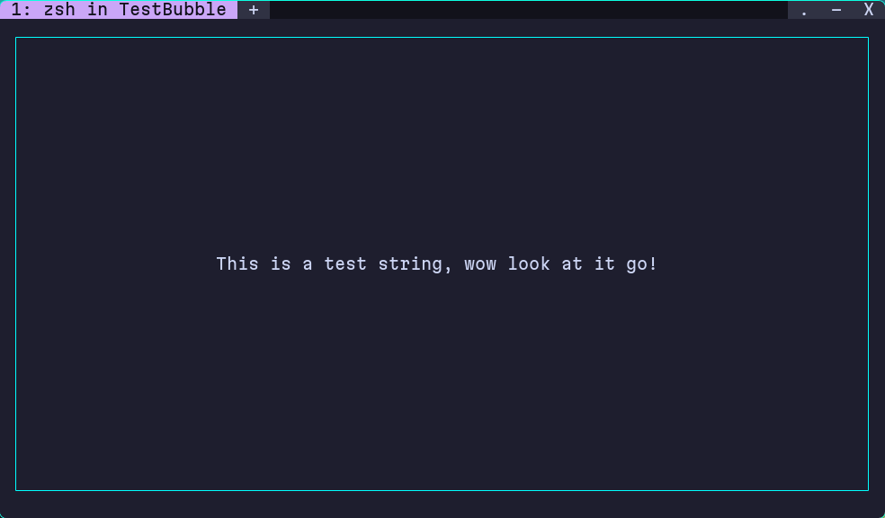

# Welcome to BubbleUp

Float your alerts to the top of your TUI like a bubble in a soda. Integrates with BubbleTea applications seamlessly to render your status updates in style.

[](https://go.dev)
[](https://opensource.org/licenses/MIT)


<!--



-->
## Requirements

- Go 1.23.1 or higher
- [BubbleTea](https://github.com/charmbracelet/bubbletea) framework

## Getting Started

Run the following to download the module:

```sh
go get go.dalton.dog/bubbleup
```

Then import it into your project with the following:

```go
import (
    "go.dalton.dog/bubbleup"
    tea "github.com/charmbracelet/bubbletea"
)
```

This is assuming you already have BubbleTea installed and available in your project. Go check out their repo [here](https://github.com/charmbracelet/bubbletea) for more information!

From there, it's as simple as creating a new `bubbleup.AlertModel` by calling `bubbleup.NewAlertModel(width, useNerdFont, duration)`, and embedding the returned model inside of your main model.

**Parameters**:
- `width` (`int`): Maximum width for alerts in characters
- `useNerdFont` (`bool`): Whether to use NerdFont symbols* or ASCII prefixes** 
- `duration` (`time.Duration`): How long alerts display before auto-dismissing _(in seconds)_

\* NerdFont must be installed on your app user's computer.<br>
\*\* Unicode prefixes also an alternate to NerdFont symbols or ASCII prefixes using the `WithUnicodePrefix()` method. 

**Basic Example**:
```go
// Create alert model: max width=50, use NerdFont, 10 second duration
alertModel := bubbleup.NewAlertModel(50, true, 10)

m := myModel{
    alert: alertModel,
}
```

See the **Configuration Options** section below for advanced features like positioning, dynamic width, and Unicode fonts.

## Configuration Options

BubbleUp supports method chaining for configuration. All `With*()` methods return the modified `AlertModel`, allowing you to chain multiple configurations:

```go
m.alert = bubbleup.NewAlertModel(50, false, 10).
    WithMinWidth(15).                              // Enable dynamic width (15-50 chars)
    WithPosition(bubbleup.TopRightPosition).       // Position at top-right
    WithUnicodePrefix().                           // Use Unicode symbols
    WithAllowEscToClose()                          // Allow ESC to dismiss alerts
```

### Position Support

Control where alerts appear on screen with `WithPosition()`:

**Available Positions**:
- `TopLeftPosition` - Top-left corner (default)
- `TopCenterPosition` - Top center
- `TopRightPosition` - Top-right corner
- `BottomLeftPosition` - Bottom-left corner
- `BottomCenterPosition` - Bottom center
- `BottomRightPosition` - Bottom-right corner

**Example**:
```go
// Show error at top-right
m.alert = m.alert.WithPosition(bubbleup.TopRightPosition)
alertCmd = m.alert.NewAlertCmd(bubbleup.ErrorKey, "Connection failed")

// Show success at bottom-center
m.alert = m.alert.WithPosition(bubbleup.BottomCenterPosition)
alertCmd = m.alert.NewAlertCmd(bubbleup.InfoKey, "File saved")
```

**Note**: Position can be changed dynamically - different alerts can appear at different positions.

### Dynamic Width Alerts

By default, alerts have a fixed width set by the `width` parameter passed to `NewAlertModel()`. You enable dynamic width alerts by setting a minimum alert with by calling the `WithMinWidth()` method. This will change BubbleUp to automatically size alarts dynamically based on message length bracketed within `minWidth` and _(max)_ `width`:

**Fixed Width Mode** _(default):_
- `minWidth == 0` or `WithMinWidth()` not called
- Alert is always `width` characters wide
- Messages wrap if longer than width

**Dynamic Width Mode**:
- Call `WithMinWidth(min)` with a minimum width
- Alert width varies between `min` and _(max)_ `width` based on message length
- Short messages = narrow alerts, long messages = wider alerts _(up to max)_
- Too short messages are right-padded with spaces to the current `minWidth`.

**Example**:
```go
// Create with max width 50, enable dynamic sizing with min 15
m.alert = bubbleup.NewAlertModel(50, true, 10).WithMinWidth(15)

// Short message: alert will be ~15-20 chars wide
alertCmd = m.alert.NewAlertCmd(bubbleup.InfoKey, "Done")

// Long message: alert will be ~45-50 chars wide
alertCmd = m.alert.NewAlertCmd(bubbleup.ErrorKey, "This is a longer error message")

// Very long message: alert will be 50 chars wide and wrapped
alertCmd = m.alert.NewAlertCmd(bubbleup.ErrorKey, "This is a super, extra longer error message that will wrap")
```

**When to Use**:
- **Fixed width**: When you want consistent alert sizing
- **Dynamic width**: When you have varying message lengths and want compact alerts

### Font Options

BubbleUp supports three font/symbol options for alert prefixes:

**NerdFonts** _(requires installation on app user's system):_
- Beautiful icons from NerdFonts
- Users get NerdFonts at: https://nerdfonts.com
- To enable: `NewAlertModel(width, true, duration)`

**Unicode** _(works ~everywhere):_
- Standard Unicode symbols that work in most terminals
- No special font required
- Best default choice for portability
- To enable: `NewAlertModel(width, false, duration).WithUnicodePrefix()`

**ASCII** (fallback):
- Simple ASCII character prefixes: `(i)`, `(!)`, `[!!]`, `(?)`
- Works everywhere, even in restricted environments
- To enable: `NewAlertModel(width, false, duration)` (default when `useNerdFont=false`)

**When to Use**:
- **NerdFonts**: You want the nicest looking UI _(assumes you control the systems running the app.)_
    - Also when your users are either technical enough and motivated enough to install NerdFonts.
- **Unicode**: When you just want your app to work reliably without extra fuss.
- **ASCII**: When app reliability is your top-most concern.
  - Or if you want no fuss but dislike the available Unicode characters.

**Example**:
```go
// Unicode fonts (recommended for portability)
m.alert = bubbleup.NewAlertModel(50, false, 10).WithUnicodePrefix()

// NerdFont (requires NerdFont installation on user's system)
m.alert = bubbleup.NewAlertModel(50, true, 10)

// ASCII (maximum compatibility)
m.alert = bubbleup.NewAlertModel(50, false, 10)
```

### Keyboard Interaction

Enable `Esc` key to dismiss alerts before their timeout:

```go
m.alert = bubbleup.NewAlertModel(50, true, 10).WithAllowEscToClose()
```

**Handling `Esc` key in Your `Update()` Method**:

When `Esc` can close alerts, you need to check if an alert is active before handling `Esc` in your other BubbleTea models _(like for quitting your app):_

```go
func (m myModel) Update(msg tea.Msg) (tea.Model, tea.Cmd) {
    var alertCmd tea.Cmd

    switch msg := msg.(type) {
    case tea.KeyMsg:
        switch msg.String() {
        case "esc":
            // Only quit if no alert is active
            if !m.alert.HasActiveAlert() {
                return m, tea.Quit
            }
            // Alert is active - let alert.Update() handle ESC
        case "q":
            return m, tea.Quit
        case "s":
            alertCmd = m.alert.NewAlertCmd(bubbleup.InfoKey, "File saved")
        }
    }

    // Pass messages to alert model
    outAlert, outCmd := m.alert.Update(msg)
    m.alert = outAlert.(bubbleup.AlertModel)

    return m, tea.Batch(alertCmd, outCmd)
}
```

**Methods**:
- `WithAllowEscToClose()` - Enable `Esc` to close alerts
- `HasActiveAlert()` - Returns `true` if an alert is currently displayed

## Integrating Into Your BubbleTea App

### In your `Init()` Method

Be sure to `return` the result of the alert models' `Init()`.  

If you need to also `return` one or more commands, be sure to use `tea.Batch()` to bundle them together.

### In your `Update()` Method
This is where you'll actually spawn the alerts, which is as easy as calling `NewAlertCmd()` with a key and a message. The formatting and stylings are handled by what is provided in the stored `AlertDefinition` types _(more info below)._  

#### Example with the included Info alert type:

Be sure to pass any received messages to the alert model, and appropriately use the return values.  

Reassign your stored alert with the updated alert, and return the given command either alone, or via `tea.Batch()`.  
```go
alertCmd = m.alert.NewAlertCmd(bubbleup.InfoKey, "New info alert.") // Get the command to initiate the desired alert

outAlert, outCmd := m.alert.Update(msg)  // Pass any messages to the alert model, such as alert or tick messages
m.alert = outAlert.(bubbleup.AlertModel) // Reassign the returned alert model to the main model

return m, tea.Batch(alertCmd, outCmd)
```

**Note**: If you enabled `WithAllowEscToClose()`, see the [Keyboard Interaction](#keyboard-interaction) section for handling `Esc` key properly.

### In your `View()` Method

You want to do all of your normal view code to render your output, and **_then_** pass that into your alert model's `Render()` function. This will overlay the alert onto the provided content. We recommend you  have this be the last thing you do in your `View()` function.

_**NOTE:**_ The `AlertModel`'s `View()` function is empty and is not intended to be called.

## Creating Your Own Alert Types

You can create your own alert types by creating an instance of an `AlertDefinition` struct, and passing it into your model's `RegisterNewAlertType()` function. The `AlertDefinition` consists of the following parts:  
- `Key`: _(Required)_ Unique identifier for your alert type. What is passed into `NewAlertCmd` to get rendering information.
- `ForeColor`: _(Required)_ A hex color string that you want to use as the foreground color of your alert type, for example: `"#00FF00"`.
- `Style`: _(Optional)_ A `lipgloss.Style` struct that will override the default one, but it's up to you to make sure your override meshes well.
- `Prefix`: _(Optional)_ The symbol or strings used to prefix your message contents. Can be left empty


### Example

You would declare and register your new alert type like this:

```go
    myCustomAlert := AlertDefinition{
        Key: "CoolAlert",
        ForeColor: "#123456",
        Prefix: ":)"
    }

    m.alertModel.RegisterNewAlertType(myCustomAlert)
```

**_NOTE_:** We did not pass a style so BubbleUp will use the default style.

Then call it later by using the following code:

```go
outAlertCmd := m.alert.NewAlertCmd("CoolAlert", "My really cool alert message")
```

Then interact with `outAlertCmd` as described in the `Update` section above.

## Complete Example

See [example](examples/example_main.go) for a complete working example demonstrating all features:
- `examples/example_main.go`

## Documentation

Full API documentation is available at [pkg.go.dev/go.dalton.dog/bubbleup](https://pkg.go.dev/go.dalton.dog/bubbleup)

## Credits

- Conceived of and created by [Dalton Williams](https://github.com/joel-sgc).
- Built on top of [Charm's BubbleTea](https://github.com/charmbracelet/bubbletea) framework.
- Contributions:
  - [Mike Schinkel](https://github.com/mikeschinkel):
    - Top/Bottom + Left/Center/Right alert positioning, 
    - Unicode message prefix for alerts,
    - Dynamic width alerts,
    - Enabling `Esc` to close alerts,
    - Enhanced [example app](examples/example_main.go),
    - [Screen recording](examples/example_main.gif) of example app, and
    - [vhs](https://github.com/charmbracelet/vhs) tape [record script](examples/record-example.sh) for example app.

## Contributing

Contributions are welcome! Please feel free to submit a [Pull Request](https://github.com/joel-sgc/bubbleup/pulls).

## Support

Submit bug reports via [GitHub Issues](https://github.com/joel-sgc/bubbleup/issues).

## License

This project is licensed under the **MIT License**.

See the [LICENSE](LICENSE) file for details.
